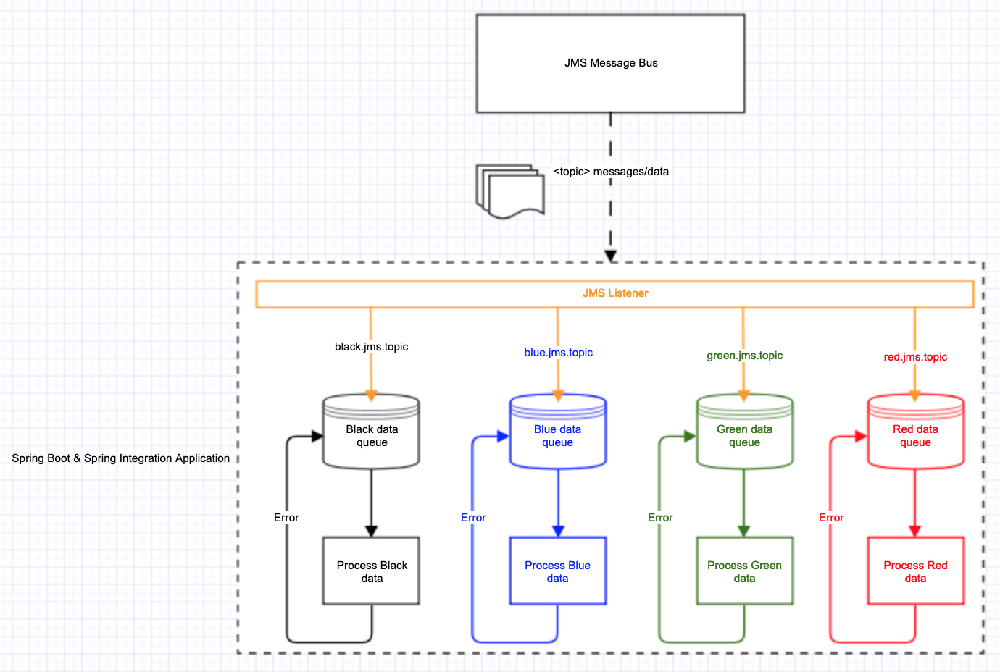

# Spring Boot and Spring Integration with JMS

This is an example project that demonstrates utilisation of Spring Boot and Spring Integration frameworks to send, receive and process JMS messages with out-of-the-box features of both. This means that there is minimal code written and any written code is only for implementing business logic. This avoids writing mass code for technical logic such as infrastructure configuration, workflow orchestration, object lifecycles and relationship behaviour.

## Overview

This implementation is a Spring Boot application that boots up an in-memory Apache MQ message broker with 4 topics. This implementation can be altered or extended to integrate with an external message bus.   
Spring Integration is used as a layer to send and receive JMS messages and pass receiving messages' payload to specific channels for processing. Each channel has a dedicated queue of size 100 and a dedicated single executor (worker thread) to process items in the queue as they arrive. Exception handling is put into practice by adding the current item being processed back into the same queue for processing again later by a gateway. This application is therefore a multi-threaded application that operates asynchronously in an out of order fashion, adhering to the multi-producer single-consumer paradigm. 

With this approach, one can dynamically scale a process' throughput/performance/throttling with minimal configuration changes only, minimal resource impact and no coding or paradigm changes. Specific examples of this:

* Increment the number of executor threads of a channel (e.g. 1 to 5)
* Change the size of a queue (e.g. 100 to 200)
* Change the route of the payload 
* Introduce batching of messages and the size of the batch that goes through the workflow (e.g. from 1 to 1000 in one go)

## Diagram of application workflow



## Walkthrough of application workflow and setup

The application workflow itself is simple. The application sends 100 messages to the 4 topics on the message bus and prints out the message once received. The 4 topics are:

1. `black.jms.topic`
2. `blue.jms.topic`
3. `green.jms.topic`
4. `red.jms.topic`

The message generated, sent and printed out is a String that identifies what type of data it is appended by an index number. 

There are several files and packages in the source tree under the src/main/ root folder:

* **JmsAndSpringIntegrationApplication.java** : The main application class that will start Spring Boot, load the Spring Integration Framework configuration and send a message through the gateway.
* **messaging-configuration.xml** : The Spring Integration context file that defines all messaging aspects: JMS topics; messaging workflow and lifecycle of the application (sending, receiving and routing JMS messages to internal queues); executors and queue sizes for processing data; the definition of the components and relationship with each other; component activation and tying it all into place.
* **MessageDataProcessor.java** : The interface for processing the payload of the incoming JMS message
* **BlackDataProcessor.java**, **BlueDataProcessor.java**, **GreenDataProcessor.java**, **RedDataProcessor.java** : implementations of the **MessageDataProcessor** interface that line up with the respective topic names.
* **Gateway.java** : The interface representing the gateway that have methods to retry processing data for each respective instrument type (black, blue, green, red). This is configured in the **messaging-configuration.xml** to add the data back the the processing queue of the processing channel.

### Instrument type configuration

Each instrument type has the following setup (in **messaging-configuration.xml**) :
1. A JMS topic in the format `<colour>.jms.topic`
2. A JMS outbound adapter to send messages (`<jms:outbound-channel-adapter>`) and a JMS inbound adapter (`<jms:message-driven-channel-adapter>`) to listen for messages for the topic, extract its payload and send it to the relevant Spring Integration channel's queue.
3. A Spring Integration channel named in the format `send<colour>Channel`, which binds to the respective `<jms:outbound-channel-adapter>` that acts as a an abstraction and facade, which will send a JMS message on the message bus with the respective instrument's topic name (as explained in point numbers 1,2)
3. A Spring Integration channel named in the format `<colour>DataChannel` that the payload is passed to. The channel has a complementing executor named in the format `<colour>DataExecutor` configured to have a `queue-size` of 100 and a `pool-size` of 1 (which is the number of threads for the executor)
4. A `<int:service-activator>` for each channel that will invoke the `processData` method of the instrument type's processor class (named in the format `<colour>DataProcessor`) when an item appears in the channel's queue.
5. A Gateway method named in the format `retryProcessing<colour>Data` that will pass the data to the back of the queue of that instrument type's Spring Integration channel (as explained in point number 3)

## Running the application
Run the `JmsAndSpringIntegrationApplication` class as a Java application. It will print out Spring Boot startup log messages and then print out the message that has been sent to the message bus, received by the listener, routed to the Spring Integration channel's queue and being processed by the executor. The printed output of the entire application run should turn out like the following:

```

  .   ____          _            __ _ _
 /\\ / ___'_ __ _ _(_)_ __  __ _ \ \ \ \
( ( )\___ | '_ | '_| | '_ \/ _` | \ \ \ \
 \\/  ___)| |_)| | | | | || (_| |  ) ) ) )
  '  |____| .__|_| |_|_| |_\__, | / / / /
 =========|_|==============|___/=/_/_/_/
 :: Spring Boot ::       (v1.5.17.RELEASE)

2019-03-10 21:11:56 -INFO- [main] c.e.j.JmsAndSpringIntegrationApplication Starting JmsAndSpringIntegrationApplication with PID 11236 (/workspace/spring-boot-and-spring-integration-with-jms/target/classes
2019-03-10 21:11:56 -INFO- [main] c.e.j.JmsAndSpringIntegrationApplication No active profile set, falling back to default profiles: default
2019-03-10 21:11:56 -INFO- [main] o.s.c.a.AnnotationConfigApplicationContext Refreshing org.springframework.context.annotation.AnnotationConfigApplicationContext@4f9a3314: startup date [Sun Mar 10 21:11:56 GMT 2019]; root of context hierarchy
2019-03-10 21:11:56 -INFO- [main] o.s.b.f.x.XmlBeanDefinitionReader Loading XML bean definitions from URL [file:/workspace/spring-boot-and-spring-integration-with-jms/target/classes/messaging-configuration.xml]
2019-03-10 21:11:56 -INFO- [main] o.s.i.c.IntegrationRegistrar No bean named 'integrationHeaderChannelRegistry' has been explicitly defined. Therefore, a default DefaultHeaderChannelRegistry will be created.
2019-03-10 21:11:57 -INFO- [main] o.s.i.c.DefaultConfiguringBeanFactoryPostProcessor No bean named 'errorChannel' has been explicitly defined. Therefore, a default PublishSubscribeChannel will be created.
2019-03-10 21:11:57 -INFO- [main] o.s.i.c.DefaultConfiguringBeanFactoryPostProcessor No bean named 'taskScheduler' has been explicitly defined. Therefore, a default ThreadPoolTaskScheduler will be created.
2019-03-10 21:11:57 -INFO- [main] o.s.c.s.PostProcessorRegistrationDelegate$BeanPostProcessorChecker Bean 'integrationGlobalProperties' of type [org.springframework.beans.factory.config.PropertiesFactoryBean] is not eligible for getting processed by all BeanPostProcessors (for example: not eligible for auto-proxying)
2019-03-10 21:11:57 -INFO- [main] o.s.c.s.PostProcessorRegistrationDelegate$BeanPostProcessorChecker Bean 'integrationGlobalProperties' of type [java.util.Properties] is not eligible for getting processed by all BeanPostProcessors (for example: not eligible for auto-proxying)
2019-03-10 21:11:57 -INFO- [main] o.s.s.c.ThreadPoolTaskScheduler Initializing ExecutorService 'taskScheduler'
2019-03-10 21:11:57 -INFO- [main] o.s.s.c.ThreadPoolTaskExecutor Initializing ExecutorService
2019-03-10 21:11:57 -INFO- [main] o.s.s.c.ThreadPoolTaskExecutor Initializing ExecutorService
2019-03-10 21:11:57 -INFO- [main] o.s.s.c.ThreadPoolTaskExecutor Initializing ExecutorService
2019-03-10 21:11:57 -INFO- [main] o.s.s.c.ThreadPoolTaskExecutor Initializing ExecutorService
2019-03-10 21:11:57 -INFO- [main] o.s.j.e.a.AnnotationMBeanExporter Registering beans for JMX exposure on startup
2019-03-10 21:11:57 -INFO- [main] o.s.c.s.DefaultLifecycleProcessor Starting beans in phase 0
2019-03-10 21:11:57 -INFO- [main] o.s.i.e.EventDrivenConsumer Adding {jms:outbound-channel-adapter:greenJMSOutboundAdapter} as a subscriber to the 'sendGreenChannel' channel
2019-03-10 21:11:57 -INFO- [main] o.s.i.c.DirectChannel Channel 'application.sendGreenChannel' has 1 subscriber(s).
2019-03-10 21:11:57 -INFO- [main] o.s.i.e.EventDrivenConsumer started greenJMSOutboundAdapter
2019-03-10 21:11:57 -INFO- [main] o.s.i.e.EventDrivenConsumer Adding {jms:outbound-channel-adapter:redJMSOutboundAdapter} as a subscriber to the 'sendRedChannel' channel
2019-03-10 21:11:57 -INFO- [main] o.s.i.c.DirectChannel Channel 'application.sendRedChannel' has 1 subscriber(s).
2019-03-10 21:11:57 -INFO- [main] o.s.i.e.EventDrivenConsumer started redJMSOutboundAdapter
2019-03-10 21:11:57 -INFO- [main] o.s.i.e.EventDrivenConsumer Adding {jms:outbound-channel-adapter:blueJMSOutboundAdapter} as a subscriber to the 'sendBlueChannel' channel
2019-03-10 21:11:57 -INFO- [main] o.s.i.c.DirectChannel Channel 'application.sendBlueChannel' has 1 subscriber(s).
2019-03-10 21:11:57 -INFO- [main] o.s.i.e.EventDrivenConsumer started blueJMSOutboundAdapter
2019-03-10 21:11:57 -INFO- [main] o.s.i.e.EventDrivenConsumer Adding {jms:outbound-channel-adapter:blackJMSOutboundAdapter} as a subscriber to the 'sendBlackChannel' channel
2019-03-10 21:11:57 -INFO- [main] o.s.i.c.DirectChannel Channel 'application.sendBlackChannel' has 1 subscriber(s).
2019-03-10 21:11:57 -INFO- [main] o.s.i.e.EventDrivenConsumer started blackJMSOutboundAdapter
2019-03-10 21:11:57 -INFO- [main] o.s.i.e.EventDrivenConsumer Adding {service-activator} as a subscriber to the 'greenDataChannel' channel
2019-03-10 21:11:57 -INFO- [main] o.s.i.c.ExecutorChannel Channel 'application.greenDataChannel' has 1 subscriber(s).
2019-03-10 21:11:57 -INFO- [main] o.s.i.e.EventDrivenConsumer started org.springframework.integration.config.ConsumerEndpointFactoryBean#0
2019-03-10 21:11:57 -INFO- [main] o.s.i.e.EventDrivenConsumer Adding {service-activator} as a subscriber to the 'redDataChannel' channel
2019-03-10 21:11:57 -INFO- [main] o.s.i.c.ExecutorChannel Channel 'application.redDataChannel' has 1 subscriber(s).
2019-03-10 21:11:57 -INFO- [main] o.s.i.e.EventDrivenConsumer started org.springframework.integration.config.ConsumerEndpointFactoryBean#1
2019-03-10 21:11:57 -INFO- [main] o.s.i.e.EventDrivenConsumer Adding {service-activator} as a subscriber to the 'blueDataChannel' channel
2019-03-10 21:11:57 -INFO- [main] o.s.i.c.ExecutorChannel Channel 'application.blueDataChannel' has 1 subscriber(s).
2019-03-10 21:11:57 -INFO- [main] o.s.i.e.EventDrivenConsumer started org.springframework.integration.config.ConsumerEndpointFactoryBean#2
2019-03-10 21:11:57 -INFO- [main] o.s.i.e.EventDrivenConsumer Adding {service-activator} as a subscriber to the 'blackDataChannel' channel
2019-03-10 21:11:57 -INFO- [main] o.s.i.c.ExecutorChannel Channel 'application.blackDataChannel' has 1 subscriber(s).
2019-03-10 21:11:57 -INFO- [main] o.s.i.e.EventDrivenConsumer started org.springframework.integration.config.ConsumerEndpointFactoryBean#3
2019-03-10 21:11:57 -INFO- [main] o.s.i.g.GatewayProxyFactoryBean$MethodInvocationGateway started gateway
2019-03-10 21:11:57 -INFO- [main] o.s.i.g.GatewayProxyFactoryBean$MethodInvocationGateway started gateway
2019-03-10 21:11:57 -INFO- [main] o.s.i.g.GatewayProxyFactoryBean$MethodInvocationGateway started gateway
2019-03-10 21:11:57 -INFO- [main] o.s.i.g.GatewayProxyFactoryBean$MethodInvocationGateway started gateway
2019-03-10 21:11:57 -INFO- [main] o.s.i.g.GatewayCompletableFutureProxyFactoryBean started gateway
2019-03-10 21:11:57 -INFO- [main] o.s.i.e.EventDrivenConsumer Adding {logging-channel-adapter:_org.springframework.integration.errorLogger} as a subscriber to the 'errorChannel' channel
2019-03-10 21:11:58 -INFO- [main] o.s.i.c.PublishSubscribeChannel Channel 'application.errorChannel' has 1 subscriber(s).
2019-03-10 21:11:58 -INFO- [main] o.s.i.e.EventDrivenConsumer started _org.springframework.integration.errorLogger
2019-03-10 21:11:58 -INFO- [main] o.s.c.s.DefaultLifecycleProcessor Starting beans in phase 1073741823
2019-03-10 21:11:58 -INFO- [main] o.s.i.j.ChannelPublishingJmsMessageListener$GatewayDelegate started org.springframework.integration.jms.ChannelPublishingJmsMessageListener$GatewayDelegate@25f7391e
2019-03-10 21:11:58 -INFO- [main] o.a.a.b.BrokerService Using Persistence Adapter: MemoryPersistenceAdapter
2019-03-10 21:11:58 -INFO- [JMX connector] o.a.a.b.j.ManagementContext JMX consoles can connect to service:jmx:rmi:///jndi/rmi://localhost:1099/jmxrmi
2019-03-10 21:11:58 -INFO- [main] o.a.a.b.BrokerService Apache ActiveMQ 5.14.5 (localhost, ID:Jims-MBP-59904-1552252318092-0:1) is starting
2019-03-10 21:11:58 -INFO- [main] o.a.a.b.BrokerService Apache ActiveMQ 5.14.5 (localhost, ID:Jims-MBP-59904-1552252318092-0:1) started
2019-03-10 21:11:58 -INFO- [main] o.a.a.b.BrokerService For help or more information please see: http://activemq.apache.org
2019-03-10 21:11:58 -INFO- [main] o.a.a.b.TransportConnector Connector vm://localhost started
2019-03-10 21:11:58 -INFO- [main] o.s.i.j.JmsMessageDrivenEndpoint started greenJMSInboundAdapter
2019-03-10 21:11:58 -INFO- [main] o.s.i.j.ChannelPublishingJmsMessageListener$GatewayDelegate started org.springframework.integration.jms.ChannelPublishingJmsMessageListener$GatewayDelegate@669253b7
2019-03-10 21:11:58 -INFO- [main] o.s.i.j.JmsMessageDrivenEndpoint started redJMSInboundAdapter
2019-03-10 21:11:58 -INFO- [main] o.s.i.j.ChannelPublishingJmsMessageListener$GatewayDelegate started org.springframework.integration.jms.ChannelPublishingJmsMessageListener$GatewayDelegate@51a06cbe
2019-03-10 21:11:58 -INFO- [main] o.s.i.j.JmsMessageDrivenEndpoint started blueJMSInboundAdapter
2019-03-10 21:11:58 -INFO- [main] o.s.i.j.ChannelPublishingJmsMessageListener$GatewayDelegate started org.springframework.integration.jms.ChannelPublishingJmsMessageListener$GatewayDelegate@49a64d82
2019-03-10 21:11:58 -INFO- [main] o.s.i.j.JmsMessageDrivenEndpoint started blackJMSInboundAdapter
2019-03-10 21:11:58 -INFO- [main] o.s.c.s.DefaultLifecycleProcessor Starting beans in phase 2147483647
2019-03-10 21:11:58 -INFO- [main] c.e.j.JmsAndSpringIntegrationApplication Started JmsAndSpringIntegrationApplication in 2.509 seconds (JVM running for 2.965)
2019-03-10 21:11:58 -INFO- [greenDataExecutor-1] c.e.j.m.c.GreenDataProcessor Retrieved Message: GREEN DATA 1
2019-03-10 21:11:58 -INFO- [redDataExecutor-1] c.e.j.m.c.RedDataProcessor Retrieved Message: RED DATA 1
2019-03-10 21:11:58 -INFO- [blueDataExecutor-1] c.e.j.m.c.BlueDataProcessor Retrieved Message: BLUE DATA 1
2019-03-10 21:11:58 -INFO- [blackDataExecutor-1] c.e.j.m.c.BlackDataProcessor Retrieved Message: BLACK DATA 1
2019-03-10 21:11:58 -INFO- [greenDataExecutor-1] c.e.j.m.c.GreenDataProcessor Retrieved Message: GREEN DATA 2
2019-03-10 21:11:58 -INFO- [redDataExecutor-1] c.e.j.m.c.RedDataProcessor Retrieved Message: RED DATA 2
2019-03-10 21:11:58 -INFO- [blueDataExecutor-1] c.e.j.m.c.BlueDataProcessor Retrieved Message: BLUE DATA 2
2019-03-10 21:11:58 -INFO- [blackDataExecutor-1] c.e.j.m.c.BlackDataProcessor Retrieved Message: BLACK DATA 2
2019-03-10 21:11:58 -INFO- [greenDataExecutor-1] c.e.j.m.c.GreenDataProcessor Retrieved Message: GREEN DATA 3
2019-03-10 21:11:58 -INFO- [redDataExecutor-1] c.e.j.m.c.RedDataProcessor Retrieved Message: RED DATA 3
2019-03-10 21:11:58 -INFO- [blueDataExecutor-1] c.e.j.m.c.BlueDataProcessor Retrieved Message: BLUE DATA 3
2019-03-10 21:11:58 -INFO- [blackDataExecutor-1] c.e.j.m.c.BlackDataProcessor Retrieved Message: BLACK DATA 3
2019-03-10 21:11:58 -INFO- [greenDataExecutor-1] c.e.j.m.c.GreenDataProcessor Retrieved Message: GREEN DATA 4
2019-03-10 21:11:58 -INFO- [redDataExecutor-1] c.e.j.m.c.RedDataProcessor Retrieved Message: RED DATA 4
2019-03-10 21:11:58 -INFO- [blueDataExecutor-1] c.e.j.m.c.BlueDataProcessor Retrieved Message: BLUE DATA 4
2019-03-10 21:11:58 -INFO- [blackDataExecutor-1] c.e.j.m.c.BlackDataProcessor Retrieved Message: BLACK DATA 4
2019-03-10 21:11:58 -INFO- [greenDataExecutor-1] c.e.j.m.c.GreenDataProcessor Retrieved Message: GREEN DATA 5
2019-03-10 21:11:58 -INFO- [redDataExecutor-1] c.e.j.m.c.RedDataProcessor Retrieved Message: RED DATA 5
2019-03-10 21:11:58 -INFO- [blueDataExecutor-1] c.e.j.m.c.BlueDataProcessor Retrieved Message: BLUE DATA 5
2019-03-10 21:11:58 -INFO- [blackDataExecutor-1] c.e.j.m.c.BlackDataProcessor Retrieved Message: BLACK DATA 5
2019-03-10 21:11:58 -INFO- [greenDataExecutor-1] c.e.j.m.c.GreenDataProcessor Retrieved Message: GREEN DATA 6
2019-03-10 21:11:58 -INFO- [redDataExecutor-1] c.e.j.m.c.RedDataProcessor Retrieved Message: RED DATA 6
2019-03-10 21:11:58 -INFO- [blueDataExecutor-1] c.e.j.m.c.BlueDataProcessor Retrieved Message: BLUE DATA 6
2019-03-10 21:11:58 -INFO- [blackDataExecutor-1] c.e.j.m.c.BlackDataProcessor Retrieved Message: BLACK DATA 6
2019-03-10 21:11:58 -INFO- [greenDataExecutor-1] c.e.j.m.c.GreenDataProcessor Retrieved Message: GREEN DATA 7
2019-03-10 21:11:58 -INFO- [redDataExecutor-1] c.e.j.m.c.RedDataProcessor Retrieved Message: RED DATA 7
2019-03-10 21:11:58 -INFO- [blueDataExecutor-1] c.e.j.m.c.BlueDataProcessor Retrieved Message: BLUE DATA 7
2019-03-10 21:11:58 -INFO- [blackDataExecutor-1] c.e.j.m.c.BlackDataProcessor Retrieved Message: BLACK DATA 7
2019-03-10 21:11:58 -INFO- [greenDataExecutor-1] c.e.j.m.c.GreenDataProcessor Retrieved Message: GREEN DATA 8
2019-03-10 21:11:58 -INFO- [redDataExecutor-1] c.e.j.m.c.RedDataProcessor Retrieved Message: RED DATA 8
2019-03-10 21:11:58 -INFO- [blueDataExecutor-1] c.e.j.m.c.BlueDataProcessor Retrieved Message: BLUE DATA 8
2019-03-10 21:11:58 -INFO- [blackDataExecutor-1] c.e.j.m.c.BlackDataProcessor Retrieved Message: BLACK DATA 8
2019-03-10 21:11:58 -INFO- [greenDataExecutor-1] c.e.j.m.c.GreenDataProcessor Retrieved Message: GREEN DATA 9
2019-03-10 21:11:58 -INFO- [redDataExecutor-1] c.e.j.m.c.RedDataProcessor Retrieved Message: RED DATA 9
2019-03-10 21:11:58 -INFO- [blueDataExecutor-1] c.e.j.m.c.BlueDataProcessor Retrieved Message: BLUE DATA 9
2019-03-10 21:11:58 -INFO- [blackDataExecutor-1] c.e.j.m.c.BlackDataProcessor Retrieved Message: BLACK DATA 9
2019-03-10 21:11:58 -INFO- [greenDataExecutor-1] c.e.j.m.c.GreenDataProcessor Retrieved Message: GREEN DATA 10
2019-03-10 21:11:58 -INFO- [redDataExecutor-1] c.e.j.m.c.RedDataProcessor Retrieved Message: RED DATA 10
2019-03-10 21:11:58 -INFO- [blueDataExecutor-1] c.e.j.m.c.BlueDataProcessor Retrieved Message: BLUE DATA 10
2019-03-10 21:11:58 -INFO- [blackDataExecutor-1] c.e.j.m.c.BlackDataProcessor Retrieved Message: BLACK DATA 10
2019-03-10 21:11:58 -INFO- [greenDataExecutor-1] c.e.j.m.c.GreenDataProcessor Retrieved Message: GREEN DATA 11
2019-03-10 21:11:58 -INFO- [redDataExecutor-1] c.e.j.m.c.RedDataProcessor Retrieved Message: RED DATA 11
2019-03-10 21:11:58 -INFO- [blueDataExecutor-1] c.e.j.m.c.BlueDataProcessor Retrieved Message: BLUE DATA 11
2019-03-10 21:11:58 -INFO- [blackDataExecutor-1] c.e.j.m.c.BlackDataProcessor Retrieved Message: BLACK DATA 11
2019-03-10 21:11:58 -INFO- [greenDataExecutor-1] c.e.j.m.c.GreenDataProcessor Retrieved Message: GREEN DATA 12
2019-03-10 21:11:58 -INFO- [redDataExecutor-1] c.e.j.m.c.RedDataProcessor Retrieved Message: RED DATA 12
2019-03-10 21:11:58 -INFO- [blueDataExecutor-1] c.e.j.m.c.BlueDataProcessor Retrieved Message: BLUE DATA 12
2019-03-10 21:11:58 -INFO- [blackDataExecutor-1] c.e.j.m.c.BlackDataProcessor Retrieved Message: BLACK DATA 12
2019-03-10 21:11:58 -INFO- [greenDataExecutor-1] c.e.j.m.c.GreenDataProcessor Retrieved Message: GREEN DATA 13
2019-03-10 21:11:58 -INFO- [redDataExecutor-1] c.e.j.m.c.RedDataProcessor Retrieved Message: RED DATA 13
2019-03-10 21:11:58 -INFO- [blueDataExecutor-1] c.e.j.m.c.BlueDataProcessor Retrieved Message: BLUE DATA 13
2019-03-10 21:11:58 -INFO- [blackDataExecutor-1] c.e.j.m.c.BlackDataProcessor Retrieved Message: BLACK DATA 13
2019-03-10 21:11:58 -INFO- [greenDataExecutor-1] c.e.j.m.c.GreenDataProcessor Retrieved Message: GREEN DATA 14
2019-03-10 21:11:58 -INFO- [redDataExecutor-1] c.e.j.m.c.RedDataProcessor Retrieved Message: RED DATA 14
2019-03-10 21:11:58 -INFO- [blueDataExecutor-1] c.e.j.m.c.BlueDataProcessor Retrieved Message: BLUE DATA 14
2019-03-10 21:11:58 -INFO- [blackDataExecutor-1] c.e.j.m.c.BlackDataProcessor Retrieved Message: BLACK DATA 14
2019-03-10 21:11:58 -INFO- [greenDataExecutor-1] c.e.j.m.c.GreenDataProcessor Retrieved Message: GREEN DATA 15
2019-03-10 21:11:58 -INFO- [redDataExecutor-1] c.e.j.m.c.RedDataProcessor Retrieved Message: RED DATA 15
2019-03-10 21:11:58 -INFO- [blueDataExecutor-1] c.e.j.m.c.BlueDataProcessor Retrieved Message: BLUE DATA 15
2019-03-10 21:11:58 -INFO- [blackDataExecutor-1] c.e.j.m.c.BlackDataProcessor Retrieved Message: BLACK DATA 15
2019-03-10 21:11:58 -INFO- [greenDataExecutor-1] c.e.j.m.c.GreenDataProcessor Retrieved Message: GREEN DATA 16
2019-03-10 21:11:58 -INFO- [redDataExecutor-1] c.e.j.m.c.RedDataProcessor Retrieved Message: RED DATA 16
2019-03-10 21:11:58 -INFO- [blueDataExecutor-1] c.e.j.m.c.BlueDataProcessor Retrieved Message: BLUE DATA 16
2019-03-10 21:11:58 -INFO- [blackDataExecutor-1] c.e.j.m.c.BlackDataProcessor Retrieved Message: BLACK DATA 16
2019-03-10 21:11:58 -INFO- [greenDataExecutor-1] c.e.j.m.c.GreenDataProcessor Retrieved Message: GREEN DATA 17
2019-03-10 21:11:58 -INFO- [redDataExecutor-1] c.e.j.m.c.RedDataProcessor Retrieved Message: RED DATA 17
2019-03-10 21:11:58 -INFO- [blueDataExecutor-1] c.e.j.m.c.BlueDataProcessor Retrieved Message: BLUE DATA 17
2019-03-10 21:11:58 -INFO- [blackDataExecutor-1] c.e.j.m.c.BlackDataProcessor Retrieved Message: BLACK DATA 17
2019-03-10 21:11:58 -INFO- [greenDataExecutor-1] c.e.j.m.c.GreenDataProcessor Retrieved Message: GREEN DATA 18
2019-03-10 21:11:58 -INFO- [redDataExecutor-1] c.e.j.m.c.RedDataProcessor Retrieved Message: RED DATA 18
2019-03-10 21:11:58 -INFO- [blueDataExecutor-1] c.e.j.m.c.BlueDataProcessor Retrieved Message: BLUE DATA 18
2019-03-10 21:11:58 -INFO- [blackDataExecutor-1] c.e.j.m.c.BlackDataProcessor Retrieved Message: BLACK DATA 18
2019-03-10 21:11:58 -INFO- [greenDataExecutor-1] c.e.j.m.c.GreenDataProcessor Retrieved Message: GREEN DATA 19
2019-03-10 21:11:58 -INFO- [redDataExecutor-1] c.e.j.m.c.RedDataProcessor Retrieved Message: RED DATA 19
2019-03-10 21:11:58 -INFO- [blueDataExecutor-1] c.e.j.m.c.BlueDataProcessor Retrieved Message: BLUE DATA 19
2019-03-10 21:11:58 -INFO- [blackDataExecutor-1] c.e.j.m.c.BlackDataProcessor Retrieved Message: BLACK DATA 19
2019-03-10 21:11:58 -INFO- [greenDataExecutor-1] c.e.j.m.c.GreenDataProcessor Retrieved Message: GREEN DATA 20
2019-03-10 21:11:58 -INFO- [redDataExecutor-1] c.e.j.m.c.RedDataProcessor Retrieved Message: RED DATA 20
2019-03-10 21:11:58 -INFO- [blueDataExecutor-1] c.e.j.m.c.BlueDataProcessor Retrieved Message: BLUE DATA 20
2019-03-10 21:11:58 -INFO- [blackDataExecutor-1] c.e.j.m.c.BlackDataProcessor Retrieved Message: BLACK DATA 20
2019-03-10 21:11:58 -INFO- [greenDataExecutor-1] c.e.j.m.c.GreenDataProcessor Retrieved Message: GREEN DATA 21
2019-03-10 21:11:58 -INFO- [redDataExecutor-1] c.e.j.m.c.RedDataProcessor Retrieved Message: RED DATA 21
2019-03-10 21:11:58 -INFO- [blueDataExecutor-1] c.e.j.m.c.BlueDataProcessor Retrieved Message: BLUE DATA 21
2019-03-10 21:11:58 -INFO- [blackDataExecutor-1] c.e.j.m.c.BlackDataProcessor Retrieved Message: BLACK DATA 21
2019-03-10 21:11:58 -INFO- [greenDataExecutor-1] c.e.j.m.c.GreenDataProcessor Retrieved Message: GREEN DATA 22
2019-03-10 21:11:58 -INFO- [redDataExecutor-1] c.e.j.m.c.RedDataProcessor Retrieved Message: RED DATA 22
2019-03-10 21:11:58 -INFO- [blueDataExecutor-1] c.e.j.m.c.BlueDataProcessor Retrieved Message: BLUE DATA 22
2019-03-10 21:11:58 -INFO- [blackDataExecutor-1] c.e.j.m.c.BlackDataProcessor Retrieved Message: BLACK DATA 22
2019-03-10 21:11:58 -INFO- [greenDataExecutor-1] c.e.j.m.c.GreenDataProcessor Retrieved Message: GREEN DATA 23
2019-03-10 21:11:58 -INFO- [redDataExecutor-1] c.e.j.m.c.RedDataProcessor Retrieved Message: RED DATA 23
2019-03-10 21:11:58 -INFO- [blueDataExecutor-1] c.e.j.m.c.BlueDataProcessor Retrieved Message: BLUE DATA 23
2019-03-10 21:11:58 -INFO- [blackDataExecutor-1] c.e.j.m.c.BlackDataProcessor Retrieved Message: BLACK DATA 23
2019-03-10 21:11:58 -INFO- [greenDataExecutor-1] c.e.j.m.c.GreenDataProcessor Retrieved Message: GREEN DATA 24
2019-03-10 21:11:58 -INFO- [redDataExecutor-1] c.e.j.m.c.RedDataProcessor Retrieved Message: RED DATA 24
2019-03-10 21:11:58 -INFO- [blueDataExecutor-1] c.e.j.m.c.BlueDataProcessor Retrieved Message: BLUE DATA 24
2019-03-10 21:11:58 -INFO- [blackDataExecutor-1] c.e.j.m.c.BlackDataProcessor Retrieved Message: BLACK DATA 24
2019-03-10 21:11:58 -INFO- [greenDataExecutor-1] c.e.j.m.c.GreenDataProcessor Retrieved Message: GREEN DATA 25
2019-03-10 21:11:58 -INFO- [redDataExecutor-1] c.e.j.m.c.RedDataProcessor Retrieved Message: RED DATA 25
2019-03-10 21:11:58 -INFO- [blueDataExecutor-1] c.e.j.m.c.BlueDataProcessor Retrieved Message: BLUE DATA 25
2019-03-10 21:11:58 -INFO- [blackDataExecutor-1] c.e.j.m.c.BlackDataProcessor Retrieved Message: BLACK DATA 25
2019-03-10 21:11:58 -INFO- [greenDataExecutor-1] c.e.j.m.c.GreenDataProcessor Retrieved Message: GREEN DATA 26
2019-03-10 21:11:58 -INFO- [redDataExecutor-1] c.e.j.m.c.RedDataProcessor Retrieved Message: RED DATA 26
2019-03-10 21:11:58 -INFO- [blueDataExecutor-1] c.e.j.m.c.BlueDataProcessor Retrieved Message: BLUE DATA 26
2019-03-10 21:11:58 -INFO- [blackDataExecutor-1] c.e.j.m.c.BlackDataProcessor Retrieved Message: BLACK DATA 26
2019-03-10 21:11:58 -INFO- [greenDataExecutor-1] c.e.j.m.c.GreenDataProcessor Retrieved Message: GREEN DATA 27
2019-03-10 21:11:58 -INFO- [redDataExecutor-1] c.e.j.m.c.RedDataProcessor Retrieved Message: RED DATA 27
2019-03-10 21:11:58 -INFO- [blueDataExecutor-1] c.e.j.m.c.BlueDataProcessor Retrieved Message: BLUE DATA 27
2019-03-10 21:11:58 -INFO- [blackDataExecutor-1] c.e.j.m.c.BlackDataProcessor Retrieved Message: BLACK DATA 27
2019-03-10 21:11:58 -INFO- [greenDataExecutor-1] c.e.j.m.c.GreenDataProcessor Retrieved Message: GREEN DATA 28
2019-03-10 21:11:58 -INFO- [redDataExecutor-1] c.e.j.m.c.RedDataProcessor Retrieved Message: RED DATA 28
2019-03-10 21:11:58 -INFO- [blueDataExecutor-1] c.e.j.m.c.BlueDataProcessor Retrieved Message: BLUE DATA 28
2019-03-10 21:11:58 -INFO- [blackDataExecutor-1] c.e.j.m.c.BlackDataProcessor Retrieved Message: BLACK DATA 28
2019-03-10 21:11:58 -INFO- [greenDataExecutor-1] c.e.j.m.c.GreenDataProcessor Retrieved Message: GREEN DATA 29
2019-03-10 21:11:58 -INFO- [redDataExecutor-1] c.e.j.m.c.RedDataProcessor Retrieved Message: RED DATA 29
2019-03-10 21:11:58 -INFO- [blueDataExecutor-1] c.e.j.m.c.BlueDataProcessor Retrieved Message: BLUE DATA 29
2019-03-10 21:11:58 -INFO- [blackDataExecutor-1] c.e.j.m.c.BlackDataProcessor Retrieved Message: BLACK DATA 29
2019-03-10 21:11:58 -INFO- [greenDataExecutor-1] c.e.j.m.c.GreenDataProcessor Retrieved Message: GREEN DATA 30
2019-03-10 21:11:58 -INFO- [redDataExecutor-1] c.e.j.m.c.RedDataProcessor Retrieved Message: RED DATA 30
2019-03-10 21:11:58 -INFO- [blueDataExecutor-1] c.e.j.m.c.BlueDataProcessor Retrieved Message: BLUE DATA 30
2019-03-10 21:11:58 -INFO- [blackDataExecutor-1] c.e.j.m.c.BlackDataProcessor Retrieved Message: BLACK DATA 30
2019-03-10 21:11:58 -INFO- [greenDataExecutor-1] c.e.j.m.c.GreenDataProcessor Retrieved Message: GREEN DATA 31
2019-03-10 21:11:58 -INFO- [redDataExecutor-1] c.e.j.m.c.RedDataProcessor Retrieved Message: RED DATA 31
2019-03-10 21:11:58 -INFO- [blueDataExecutor-1] c.e.j.m.c.BlueDataProcessor Retrieved Message: BLUE DATA 31
2019-03-10 21:11:58 -INFO- [blackDataExecutor-1] c.e.j.m.c.BlackDataProcessor Retrieved Message: BLACK DATA 31
2019-03-10 21:11:58 -INFO- [greenDataExecutor-1] c.e.j.m.c.GreenDataProcessor Retrieved Message: GREEN DATA 32
2019-03-10 21:11:58 -INFO- [redDataExecutor-1] c.e.j.m.c.RedDataProcessor Retrieved Message: RED DATA 32
2019-03-10 21:11:58 -INFO- [blueDataExecutor-1] c.e.j.m.c.BlueDataProcessor Retrieved Message: BLUE DATA 32
2019-03-10 21:11:58 -INFO- [blackDataExecutor-1] c.e.j.m.c.BlackDataProcessor Retrieved Message: BLACK DATA 32
2019-03-10 21:11:58 -INFO- [greenDataExecutor-1] c.e.j.m.c.GreenDataProcessor Retrieved Message: GREEN DATA 33
2019-03-10 21:11:58 -INFO- [redDataExecutor-1] c.e.j.m.c.RedDataProcessor Retrieved Message: RED DATA 33
2019-03-10 21:11:58 -INFO- [blueDataExecutor-1] c.e.j.m.c.BlueDataProcessor Retrieved Message: BLUE DATA 33
2019-03-10 21:11:58 -INFO- [blackDataExecutor-1] c.e.j.m.c.BlackDataProcessor Retrieved Message: BLACK DATA 33
2019-03-10 21:11:58 -INFO- [greenDataExecutor-1] c.e.j.m.c.GreenDataProcessor Retrieved Message: GREEN DATA 34
2019-03-10 21:11:58 -INFO- [redDataExecutor-1] c.e.j.m.c.RedDataProcessor Retrieved Message: RED DATA 34
2019-03-10 21:11:58 -INFO- [blueDataExecutor-1] c.e.j.m.c.BlueDataProcessor Retrieved Message: BLUE DATA 34
2019-03-10 21:11:58 -INFO- [blackDataExecutor-1] c.e.j.m.c.BlackDataProcessor Retrieved Message: BLACK DATA 34
2019-03-10 21:11:58 -INFO- [greenDataExecutor-1] c.e.j.m.c.GreenDataProcessor Retrieved Message: GREEN DATA 35
2019-03-10 21:11:58 -INFO- [redDataExecutor-1] c.e.j.m.c.RedDataProcessor Retrieved Message: RED DATA 35
2019-03-10 21:11:58 -INFO- [blueDataExecutor-1] c.e.j.m.c.BlueDataProcessor Retrieved Message: BLUE DATA 35
2019-03-10 21:11:58 -INFO- [blackDataExecutor-1] c.e.j.m.c.BlackDataProcessor Retrieved Message: BLACK DATA 35
2019-03-10 21:11:58 -INFO- [greenDataExecutor-1] c.e.j.m.c.GreenDataProcessor Retrieved Message: GREEN DATA 36
2019-03-10 21:11:58 -INFO- [redDataExecutor-1] c.e.j.m.c.RedDataProcessor Retrieved Message: RED DATA 36
2019-03-10 21:11:58 -INFO- [blueDataExecutor-1] c.e.j.m.c.BlueDataProcessor Retrieved Message: BLUE DATA 36
2019-03-10 21:11:58 -INFO- [blackDataExecutor-1] c.e.j.m.c.BlackDataProcessor Retrieved Message: BLACK DATA 36
2019-03-10 21:11:58 -INFO- [greenDataExecutor-1] c.e.j.m.c.GreenDataProcessor Retrieved Message: GREEN DATA 37
2019-03-10 21:11:58 -INFO- [redDataExecutor-1] c.e.j.m.c.RedDataProcessor Retrieved Message: RED DATA 37
2019-03-10 21:11:58 -INFO- [blueDataExecutor-1] c.e.j.m.c.BlueDataProcessor Retrieved Message: BLUE DATA 37
2019-03-10 21:11:58 -INFO- [blackDataExecutor-1] c.e.j.m.c.BlackDataProcessor Retrieved Message: BLACK DATA 37
2019-03-10 21:11:58 -INFO- [greenDataExecutor-1] c.e.j.m.c.GreenDataProcessor Retrieved Message: GREEN DATA 38
2019-03-10 21:11:59 -INFO- [redDataExecutor-1] c.e.j.m.c.RedDataProcessor Retrieved Message: RED DATA 38
2019-03-10 21:11:59 -INFO- [blueDataExecutor-1] c.e.j.m.c.BlueDataProcessor Retrieved Message: BLUE DATA 38
2019-03-10 21:11:59 -INFO- [blackDataExecutor-1] c.e.j.m.c.BlackDataProcessor Retrieved Message: BLACK DATA 38
2019-03-10 21:11:59 -INFO- [greenDataExecutor-1] c.e.j.m.c.GreenDataProcessor Retrieved Message: GREEN DATA 39
2019-03-10 21:11:59 -INFO- [redDataExecutor-1] c.e.j.m.c.RedDataProcessor Retrieved Message: RED DATA 39
2019-03-10 21:11:59 -INFO- [blueDataExecutor-1] c.e.j.m.c.BlueDataProcessor Retrieved Message: BLUE DATA 39
2019-03-10 21:11:59 -INFO- [blackDataExecutor-1] c.e.j.m.c.BlackDataProcessor Retrieved Message: BLACK DATA 39
2019-03-10 21:11:59 -INFO- [greenDataExecutor-1] c.e.j.m.c.GreenDataProcessor Retrieved Message: GREEN DATA 40
2019-03-10 21:11:59 -INFO- [redDataExecutor-1] c.e.j.m.c.RedDataProcessor Retrieved Message: RED DATA 40
2019-03-10 21:11:59 -INFO- [blueDataExecutor-1] c.e.j.m.c.BlueDataProcessor Retrieved Message: BLUE DATA 40
2019-03-10 21:11:59 -INFO- [blackDataExecutor-1] c.e.j.m.c.BlackDataProcessor Retrieved Message: BLACK DATA 40
2019-03-10 21:11:59 -INFO- [greenDataExecutor-1] c.e.j.m.c.GreenDataProcessor Retrieved Message: GREEN DATA 41
2019-03-10 21:11:59 -INFO- [redDataExecutor-1] c.e.j.m.c.RedDataProcessor Retrieved Message: RED DATA 41
2019-03-10 21:11:59 -INFO- [blueDataExecutor-1] c.e.j.m.c.BlueDataProcessor Retrieved Message: BLUE DATA 41
2019-03-10 21:11:59 -INFO- [blackDataExecutor-1] c.e.j.m.c.BlackDataProcessor Retrieved Message: BLACK DATA 41
2019-03-10 21:11:59 -INFO- [greenDataExecutor-1] c.e.j.m.c.GreenDataProcessor Retrieved Message: GREEN DATA 42
2019-03-10 21:11:59 -INFO- [redDataExecutor-1] c.e.j.m.c.RedDataProcessor Retrieved Message: RED DATA 42
2019-03-10 21:11:59 -INFO- [blueDataExecutor-1] c.e.j.m.c.BlueDataProcessor Retrieved Message: BLUE DATA 42
2019-03-10 21:11:59 -INFO- [blackDataExecutor-1] c.e.j.m.c.BlackDataProcessor Retrieved Message: BLACK DATA 42
2019-03-10 21:11:59 -INFO- [greenDataExecutor-1] c.e.j.m.c.GreenDataProcessor Retrieved Message: GREEN DATA 43
2019-03-10 21:11:59 -INFO- [redDataExecutor-1] c.e.j.m.c.RedDataProcessor Retrieved Message: RED DATA 43
2019-03-10 21:11:59 -INFO- [blueDataExecutor-1] c.e.j.m.c.BlueDataProcessor Retrieved Message: BLUE DATA 43
2019-03-10 21:11:59 -INFO- [blackDataExecutor-1] c.e.j.m.c.BlackDataProcessor Retrieved Message: BLACK DATA 43
2019-03-10 21:11:59 -INFO- [greenDataExecutor-1] c.e.j.m.c.GreenDataProcessor Retrieved Message: GREEN DATA 44
2019-03-10 21:11:59 -INFO- [redDataExecutor-1] c.e.j.m.c.RedDataProcessor Retrieved Message: RED DATA 44
2019-03-10 21:11:59 -INFO- [blueDataExecutor-1] c.e.j.m.c.BlueDataProcessor Retrieved Message: BLUE DATA 44
2019-03-10 21:11:59 -INFO- [blackDataExecutor-1] c.e.j.m.c.BlackDataProcessor Retrieved Message: BLACK DATA 44
2019-03-10 21:11:59 -INFO- [greenDataExecutor-1] c.e.j.m.c.GreenDataProcessor Retrieved Message: GREEN DATA 45
2019-03-10 21:11:59 -INFO- [redDataExecutor-1] c.e.j.m.c.RedDataProcessor Retrieved Message: RED DATA 45
2019-03-10 21:11:59 -INFO- [blueDataExecutor-1] c.e.j.m.c.BlueDataProcessor Retrieved Message: BLUE DATA 45
2019-03-10 21:11:59 -INFO- [blackDataExecutor-1] c.e.j.m.c.BlackDataProcessor Retrieved Message: BLACK DATA 45
2019-03-10 21:11:59 -INFO- [greenDataExecutor-1] c.e.j.m.c.GreenDataProcessor Retrieved Message: GREEN DATA 46
2019-03-10 21:11:59 -INFO- [redDataExecutor-1] c.e.j.m.c.RedDataProcessor Retrieved Message: RED DATA 46
2019-03-10 21:11:59 -INFO- [blueDataExecutor-1] c.e.j.m.c.BlueDataProcessor Retrieved Message: BLUE DATA 46
2019-03-10 21:11:59 -INFO- [blackDataExecutor-1] c.e.j.m.c.BlackDataProcessor Retrieved Message: BLACK DATA 46
2019-03-10 21:11:59 -INFO- [greenDataExecutor-1] c.e.j.m.c.GreenDataProcessor Retrieved Message: GREEN DATA 47
2019-03-10 21:11:59 -INFO- [redDataExecutor-1] c.e.j.m.c.RedDataProcessor Retrieved Message: RED DATA 47
2019-03-10 21:11:59 -INFO- [blueDataExecutor-1] c.e.j.m.c.BlueDataProcessor Retrieved Message: BLUE DATA 47
2019-03-10 21:11:59 -INFO- [blackDataExecutor-1] c.e.j.m.c.BlackDataProcessor Retrieved Message: BLACK DATA 47
2019-03-10 21:11:59 -INFO- [greenDataExecutor-1] c.e.j.m.c.GreenDataProcessor Retrieved Message: GREEN DATA 48
2019-03-10 21:11:59 -INFO- [redDataExecutor-1] c.e.j.m.c.RedDataProcessor Retrieved Message: RED DATA 48
2019-03-10 21:11:59 -INFO- [blueDataExecutor-1] c.e.j.m.c.BlueDataProcessor Retrieved Message: BLUE DATA 48
2019-03-10 21:11:59 -INFO- [blackDataExecutor-1] c.e.j.m.c.BlackDataProcessor Retrieved Message: BLACK DATA 48
2019-03-10 21:11:59 -INFO- [greenDataExecutor-1] c.e.j.m.c.GreenDataProcessor Retrieved Message: GREEN DATA 49
2019-03-10 21:11:59 -INFO- [redDataExecutor-1] c.e.j.m.c.RedDataProcessor Retrieved Message: RED DATA 49
2019-03-10 21:11:59 -INFO- [blueDataExecutor-1] c.e.j.m.c.BlueDataProcessor Retrieved Message: BLUE DATA 49
2019-03-10 21:11:59 -INFO- [blackDataExecutor-1] c.e.j.m.c.BlackDataProcessor Retrieved Message: BLACK DATA 49
2019-03-10 21:11:59 -INFO- [greenDataExecutor-1] c.e.j.m.c.GreenDataProcessor Retrieved Message: GREEN DATA 50
2019-03-10 21:11:59 -INFO- [redDataExecutor-1] c.e.j.m.c.RedDataProcessor Retrieved Message: RED DATA 50
2019-03-10 21:11:59 -INFO- [blueDataExecutor-1] c.e.j.m.c.BlueDataProcessor Retrieved Message: BLUE DATA 50
2019-03-10 21:11:59 -INFO- [blackDataExecutor-1] c.e.j.m.c.BlackDataProcessor Retrieved Message: BLACK DATA 50
2019-03-10 21:11:59 -INFO- [greenDataExecutor-1] c.e.j.m.c.GreenDataProcessor Retrieved Message: GREEN DATA 51
2019-03-10 21:11:59 -INFO- [redDataExecutor-1] c.e.j.m.c.RedDataProcessor Retrieved Message: RED DATA 51
2019-03-10 21:11:59 -INFO- [blueDataExecutor-1] c.e.j.m.c.BlueDataProcessor Retrieved Message: BLUE DATA 51
2019-03-10 21:11:59 -INFO- [blackDataExecutor-1] c.e.j.m.c.BlackDataProcessor Retrieved Message: BLACK DATA 51
2019-03-10 21:11:59 -INFO- [greenDataExecutor-1] c.e.j.m.c.GreenDataProcessor Retrieved Message: GREEN DATA 52
2019-03-10 21:11:59 -INFO- [redDataExecutor-1] c.e.j.m.c.RedDataProcessor Retrieved Message: RED DATA 52
2019-03-10 21:11:59 -INFO- [blueDataExecutor-1] c.e.j.m.c.BlueDataProcessor Retrieved Message: BLUE DATA 52
2019-03-10 21:11:59 -INFO- [blackDataExecutor-1] c.e.j.m.c.BlackDataProcessor Retrieved Message: BLACK DATA 52
2019-03-10 21:11:59 -INFO- [greenDataExecutor-1] c.e.j.m.c.GreenDataProcessor Retrieved Message: GREEN DATA 53
2019-03-10 21:11:59 -INFO- [redDataExecutor-1] c.e.j.m.c.RedDataProcessor Retrieved Message: RED DATA 53
2019-03-10 21:11:59 -INFO- [blueDataExecutor-1] c.e.j.m.c.BlueDataProcessor Retrieved Message: BLUE DATA 53
2019-03-10 21:11:59 -INFO- [blackDataExecutor-1] c.e.j.m.c.BlackDataProcessor Retrieved Message: BLACK DATA 53
2019-03-10 21:11:59 -INFO- [greenDataExecutor-1] c.e.j.m.c.GreenDataProcessor Retrieved Message: GREEN DATA 54
2019-03-10 21:11:59 -INFO- [redDataExecutor-1] c.e.j.m.c.RedDataProcessor Retrieved Message: RED DATA 54
2019-03-10 21:11:59 -INFO- [blueDataExecutor-1] c.e.j.m.c.BlueDataProcessor Retrieved Message: BLUE DATA 54
2019-03-10 21:11:59 -INFO- [blackDataExecutor-1] c.e.j.m.c.BlackDataProcessor Retrieved Message: BLACK DATA 54
2019-03-10 21:11:59 -INFO- [greenDataExecutor-1] c.e.j.m.c.GreenDataProcessor Retrieved Message: GREEN DATA 55
2019-03-10 21:11:59 -INFO- [redDataExecutor-1] c.e.j.m.c.RedDataProcessor Retrieved Message: RED DATA 55
2019-03-10 21:11:59 -INFO- [blueDataExecutor-1] c.e.j.m.c.BlueDataProcessor Retrieved Message: BLUE DATA 55
2019-03-10 21:11:59 -INFO- [blackDataExecutor-1] c.e.j.m.c.BlackDataProcessor Retrieved Message: BLACK DATA 55
2019-03-10 21:11:59 -INFO- [greenDataExecutor-1] c.e.j.m.c.GreenDataProcessor Retrieved Message: GREEN DATA 56
2019-03-10 21:11:59 -INFO- [redDataExecutor-1] c.e.j.m.c.RedDataProcessor Retrieved Message: RED DATA 56
2019-03-10 21:11:59 -INFO- [blueDataExecutor-1] c.e.j.m.c.BlueDataProcessor Retrieved Message: BLUE DATA 56
2019-03-10 21:11:59 -INFO- [blackDataExecutor-1] c.e.j.m.c.BlackDataProcessor Retrieved Message: BLACK DATA 56
2019-03-10 21:11:59 -INFO- [greenDataExecutor-1] c.e.j.m.c.GreenDataProcessor Retrieved Message: GREEN DATA 57
2019-03-10 21:11:59 -INFO- [redDataExecutor-1] c.e.j.m.c.RedDataProcessor Retrieved Message: RED DATA 57
2019-03-10 21:11:59 -INFO- [blueDataExecutor-1] c.e.j.m.c.BlueDataProcessor Retrieved Message: BLUE DATA 57
2019-03-10 21:11:59 -INFO- [blackDataExecutor-1] c.e.j.m.c.BlackDataProcessor Retrieved Message: BLACK DATA 57
2019-03-10 21:11:59 -INFO- [greenDataExecutor-1] c.e.j.m.c.GreenDataProcessor Retrieved Message: GREEN DATA 58
2019-03-10 21:11:59 -INFO- [redDataExecutor-1] c.e.j.m.c.RedDataProcessor Retrieved Message: RED DATA 58
2019-03-10 21:11:59 -INFO- [blueDataExecutor-1] c.e.j.m.c.BlueDataProcessor Retrieved Message: BLUE DATA 58
2019-03-10 21:11:59 -INFO- [blackDataExecutor-1] c.e.j.m.c.BlackDataProcessor Retrieved Message: BLACK DATA 58
2019-03-10 21:11:59 -INFO- [greenDataExecutor-1] c.e.j.m.c.GreenDataProcessor Retrieved Message: GREEN DATA 59
2019-03-10 21:11:59 -INFO- [redDataExecutor-1] c.e.j.m.c.RedDataProcessor Retrieved Message: RED DATA 59
2019-03-10 21:11:59 -INFO- [blueDataExecutor-1] c.e.j.m.c.BlueDataProcessor Retrieved Message: BLUE DATA 59
2019-03-10 21:11:59 -INFO- [blackDataExecutor-1] c.e.j.m.c.BlackDataProcessor Retrieved Message: BLACK DATA 59
2019-03-10 21:11:59 -INFO- [greenDataExecutor-1] c.e.j.m.c.GreenDataProcessor Retrieved Message: GREEN DATA 60
2019-03-10 21:11:59 -INFO- [redDataExecutor-1] c.e.j.m.c.RedDataProcessor Retrieved Message: RED DATA 60
2019-03-10 21:11:59 -INFO- [blueDataExecutor-1] c.e.j.m.c.BlueDataProcessor Retrieved Message: BLUE DATA 60
2019-03-10 21:11:59 -INFO- [blackDataExecutor-1] c.e.j.m.c.BlackDataProcessor Retrieved Message: BLACK DATA 60
2019-03-10 21:11:59 -INFO- [greenDataExecutor-1] c.e.j.m.c.GreenDataProcessor Retrieved Message: GREEN DATA 61
2019-03-10 21:11:59 -INFO- [redDataExecutor-1] c.e.j.m.c.RedDataProcessor Retrieved Message: RED DATA 61
2019-03-10 21:11:59 -INFO- [blueDataExecutor-1] c.e.j.m.c.BlueDataProcessor Retrieved Message: BLUE DATA 61
2019-03-10 21:11:59 -INFO- [blackDataExecutor-1] c.e.j.m.c.BlackDataProcessor Retrieved Message: BLACK DATA 61
2019-03-10 21:11:59 -INFO- [greenDataExecutor-1] c.e.j.m.c.GreenDataProcessor Retrieved Message: GREEN DATA 62
2019-03-10 21:11:59 -INFO- [redDataExecutor-1] c.e.j.m.c.RedDataProcessor Retrieved Message: RED DATA 62
2019-03-10 21:11:59 -INFO- [blueDataExecutor-1] c.e.j.m.c.BlueDataProcessor Retrieved Message: BLUE DATA 62
2019-03-10 21:11:59 -INFO- [blackDataExecutor-1] c.e.j.m.c.BlackDataProcessor Retrieved Message: BLACK DATA 62
2019-03-10 21:11:59 -INFO- [greenDataExecutor-1] c.e.j.m.c.GreenDataProcessor Retrieved Message: GREEN DATA 63
2019-03-10 21:11:59 -INFO- [redDataExecutor-1] c.e.j.m.c.RedDataProcessor Retrieved Message: RED DATA 63
2019-03-10 21:11:59 -INFO- [blueDataExecutor-1] c.e.j.m.c.BlueDataProcessor Retrieved Message: BLUE DATA 63
2019-03-10 21:11:59 -INFO- [blackDataExecutor-1] c.e.j.m.c.BlackDataProcessor Retrieved Message: BLACK DATA 63
2019-03-10 21:11:59 -INFO- [greenDataExecutor-1] c.e.j.m.c.GreenDataProcessor Retrieved Message: GREEN DATA 64
2019-03-10 21:11:59 -INFO- [redDataExecutor-1] c.e.j.m.c.RedDataProcessor Retrieved Message: RED DATA 64
2019-03-10 21:11:59 -INFO- [blueDataExecutor-1] c.e.j.m.c.BlueDataProcessor Retrieved Message: BLUE DATA 64
2019-03-10 21:11:59 -INFO- [blackDataExecutor-1] c.e.j.m.c.BlackDataProcessor Retrieved Message: BLACK DATA 64
2019-03-10 21:11:59 -INFO- [greenDataExecutor-1] c.e.j.m.c.GreenDataProcessor Retrieved Message: GREEN DATA 65
2019-03-10 21:11:59 -INFO- [redDataExecutor-1] c.e.j.m.c.RedDataProcessor Retrieved Message: RED DATA 65
2019-03-10 21:11:59 -INFO- [blueDataExecutor-1] c.e.j.m.c.BlueDataProcessor Retrieved Message: BLUE DATA 65
2019-03-10 21:11:59 -INFO- [blackDataExecutor-1] c.e.j.m.c.BlackDataProcessor Retrieved Message: BLACK DATA 65
2019-03-10 21:11:59 -INFO- [greenDataExecutor-1] c.e.j.m.c.GreenDataProcessor Retrieved Message: GREEN DATA 66
2019-03-10 21:11:59 -INFO- [redDataExecutor-1] c.e.j.m.c.RedDataProcessor Retrieved Message: RED DATA 66
2019-03-10 21:11:59 -INFO- [blueDataExecutor-1] c.e.j.m.c.BlueDataProcessor Retrieved Message: BLUE DATA 66
2019-03-10 21:11:59 -INFO- [blackDataExecutor-1] c.e.j.m.c.BlackDataProcessor Retrieved Message: BLACK DATA 66
2019-03-10 21:11:59 -INFO- [greenDataExecutor-1] c.e.j.m.c.GreenDataProcessor Retrieved Message: GREEN DATA 67
2019-03-10 21:11:59 -INFO- [redDataExecutor-1] c.e.j.m.c.RedDataProcessor Retrieved Message: RED DATA 67
2019-03-10 21:11:59 -INFO- [blueDataExecutor-1] c.e.j.m.c.BlueDataProcessor Retrieved Message: BLUE DATA 67
2019-03-10 21:11:59 -INFO- [blackDataExecutor-1] c.e.j.m.c.BlackDataProcessor Retrieved Message: BLACK DATA 67
2019-03-10 21:11:59 -INFO- [greenDataExecutor-1] c.e.j.m.c.GreenDataProcessor Retrieved Message: GREEN DATA 68
2019-03-10 21:11:59 -INFO- [redDataExecutor-1] c.e.j.m.c.RedDataProcessor Retrieved Message: RED DATA 68
2019-03-10 21:11:59 -INFO- [blueDataExecutor-1] c.e.j.m.c.BlueDataProcessor Retrieved Message: BLUE DATA 68
2019-03-10 21:11:59 -INFO- [blackDataExecutor-1] c.e.j.m.c.BlackDataProcessor Retrieved Message: BLACK DATA 68
2019-03-10 21:11:59 -INFO- [greenDataExecutor-1] c.e.j.m.c.GreenDataProcessor Retrieved Message: GREEN DATA 69
2019-03-10 21:11:59 -INFO- [redDataExecutor-1] c.e.j.m.c.RedDataProcessor Retrieved Message: RED DATA 69
2019-03-10 21:11:59 -INFO- [blueDataExecutor-1] c.e.j.m.c.BlueDataProcessor Retrieved Message: BLUE DATA 69
2019-03-10 21:11:59 -INFO- [blackDataExecutor-1] c.e.j.m.c.BlackDataProcessor Retrieved Message: BLACK DATA 69
2019-03-10 21:11:59 -INFO- [greenDataExecutor-1] c.e.j.m.c.GreenDataProcessor Retrieved Message: GREEN DATA 70
2019-03-10 21:11:59 -INFO- [redDataExecutor-1] c.e.j.m.c.RedDataProcessor Retrieved Message: RED DATA 70
2019-03-10 21:11:59 -INFO- [blueDataExecutor-1] c.e.j.m.c.BlueDataProcessor Retrieved Message: BLUE DATA 70
2019-03-10 21:11:59 -INFO- [blackDataExecutor-1] c.e.j.m.c.BlackDataProcessor Retrieved Message: BLACK DATA 70
2019-03-10 21:11:59 -INFO- [greenDataExecutor-1] c.e.j.m.c.GreenDataProcessor Retrieved Message: GREEN DATA 71
2019-03-10 21:11:59 -INFO- [redDataExecutor-1] c.e.j.m.c.RedDataProcessor Retrieved Message: RED DATA 71
2019-03-10 21:11:59 -INFO- [blueDataExecutor-1] c.e.j.m.c.BlueDataProcessor Retrieved Message: BLUE DATA 71
2019-03-10 21:11:59 -INFO- [blackDataExecutor-1] c.e.j.m.c.BlackDataProcessor Retrieved Message: BLACK DATA 71
2019-03-10 21:11:59 -INFO- [greenDataExecutor-1] c.e.j.m.c.GreenDataProcessor Retrieved Message: GREEN DATA 72
2019-03-10 21:11:59 -INFO- [redDataExecutor-1] c.e.j.m.c.RedDataProcessor Retrieved Message: RED DATA 72
2019-03-10 21:11:59 -INFO- [blueDataExecutor-1] c.e.j.m.c.BlueDataProcessor Retrieved Message: BLUE DATA 72
2019-03-10 21:11:59 -INFO- [blackDataExecutor-1] c.e.j.m.c.BlackDataProcessor Retrieved Message: BLACK DATA 72
2019-03-10 21:11:59 -INFO- [greenDataExecutor-1] c.e.j.m.c.GreenDataProcessor Retrieved Message: GREEN DATA 73
2019-03-10 21:11:59 -INFO- [redDataExecutor-1] c.e.j.m.c.RedDataProcessor Retrieved Message: RED DATA 73
2019-03-10 21:11:59 -INFO- [blueDataExecutor-1] c.e.j.m.c.BlueDataProcessor Retrieved Message: BLUE DATA 73
2019-03-10 21:11:59 -INFO- [blackDataExecutor-1] c.e.j.m.c.BlackDataProcessor Retrieved Message: BLACK DATA 73
2019-03-10 21:11:59 -INFO- [greenDataExecutor-1] c.e.j.m.c.GreenDataProcessor Retrieved Message: GREEN DATA 74
2019-03-10 21:11:59 -INFO- [redDataExecutor-1] c.e.j.m.c.RedDataProcessor Retrieved Message: RED DATA 74
2019-03-10 21:11:59 -INFO- [blueDataExecutor-1] c.e.j.m.c.BlueDataProcessor Retrieved Message: BLUE DATA 74
2019-03-10 21:11:59 -INFO- [blackDataExecutor-1] c.e.j.m.c.BlackDataProcessor Retrieved Message: BLACK DATA 74
2019-03-10 21:11:59 -INFO- [greenDataExecutor-1] c.e.j.m.c.GreenDataProcessor Retrieved Message: GREEN DATA 75
2019-03-10 21:11:59 -INFO- [redDataExecutor-1] c.e.j.m.c.RedDataProcessor Retrieved Message: RED DATA 75
2019-03-10 21:11:59 -INFO- [blueDataExecutor-1] c.e.j.m.c.BlueDataProcessor Retrieved Message: BLUE DATA 75
2019-03-10 21:11:59 -INFO- [blackDataExecutor-1] c.e.j.m.c.BlackDataProcessor Retrieved Message: BLACK DATA 75
2019-03-10 21:11:59 -INFO- [greenDataExecutor-1] c.e.j.m.c.GreenDataProcessor Retrieved Message: GREEN DATA 76
2019-03-10 21:11:59 -INFO- [redDataExecutor-1] c.e.j.m.c.RedDataProcessor Retrieved Message: RED DATA 76
2019-03-10 21:11:59 -INFO- [blueDataExecutor-1] c.e.j.m.c.BlueDataProcessor Retrieved Message: BLUE DATA 76
2019-03-10 21:11:59 -INFO- [blackDataExecutor-1] c.e.j.m.c.BlackDataProcessor Retrieved Message: BLACK DATA 76
2019-03-10 21:11:59 -INFO- [greenDataExecutor-1] c.e.j.m.c.GreenDataProcessor Retrieved Message: GREEN DATA 77
2019-03-10 21:11:59 -INFO- [redDataExecutor-1] c.e.j.m.c.RedDataProcessor Retrieved Message: RED DATA 77
2019-03-10 21:11:59 -INFO- [blueDataExecutor-1] c.e.j.m.c.BlueDataProcessor Retrieved Message: BLUE DATA 77
2019-03-10 21:11:59 -INFO- [blackDataExecutor-1] c.e.j.m.c.BlackDataProcessor Retrieved Message: BLACK DATA 77
2019-03-10 21:11:59 -INFO- [greenDataExecutor-1] c.e.j.m.c.GreenDataProcessor Retrieved Message: GREEN DATA 78
2019-03-10 21:11:59 -INFO- [redDataExecutor-1] c.e.j.m.c.RedDataProcessor Retrieved Message: RED DATA 78
2019-03-10 21:11:59 -INFO- [blueDataExecutor-1] c.e.j.m.c.BlueDataProcessor Retrieved Message: BLUE DATA 78
2019-03-10 21:11:59 -INFO- [blackDataExecutor-1] c.e.j.m.c.BlackDataProcessor Retrieved Message: BLACK DATA 78
2019-03-10 21:11:59 -INFO- [greenDataExecutor-1] c.e.j.m.c.GreenDataProcessor Retrieved Message: GREEN DATA 79
2019-03-10 21:11:59 -INFO- [redDataExecutor-1] c.e.j.m.c.RedDataProcessor Retrieved Message: RED DATA 79
2019-03-10 21:11:59 -INFO- [blueDataExecutor-1] c.e.j.m.c.BlueDataProcessor Retrieved Message: BLUE DATA 79
2019-03-10 21:11:59 -INFO- [blackDataExecutor-1] c.e.j.m.c.BlackDataProcessor Retrieved Message: BLACK DATA 79
2019-03-10 21:11:59 -INFO- [greenDataExecutor-1] c.e.j.m.c.GreenDataProcessor Retrieved Message: GREEN DATA 80
2019-03-10 21:11:59 -INFO- [redDataExecutor-1] c.e.j.m.c.RedDataProcessor Retrieved Message: RED DATA 80
2019-03-10 21:11:59 -INFO- [blueDataExecutor-1] c.e.j.m.c.BlueDataProcessor Retrieved Message: BLUE DATA 80
2019-03-10 21:11:59 -INFO- [blackDataExecutor-1] c.e.j.m.c.BlackDataProcessor Retrieved Message: BLACK DATA 80
2019-03-10 21:11:59 -INFO- [greenDataExecutor-1] c.e.j.m.c.GreenDataProcessor Retrieved Message: GREEN DATA 81
2019-03-10 21:11:59 -INFO- [redDataExecutor-1] c.e.j.m.c.RedDataProcessor Retrieved Message: RED DATA 81
2019-03-10 21:11:59 -INFO- [blueDataExecutor-1] c.e.j.m.c.BlueDataProcessor Retrieved Message: BLUE DATA 81
2019-03-10 21:11:59 -INFO- [blackDataExecutor-1] c.e.j.m.c.BlackDataProcessor Retrieved Message: BLACK DATA 81
2019-03-10 21:11:59 -INFO- [greenDataExecutor-1] c.e.j.m.c.GreenDataProcessor Retrieved Message: GREEN DATA 82
2019-03-10 21:11:59 -INFO- [redDataExecutor-1] c.e.j.m.c.RedDataProcessor Retrieved Message: RED DATA 82
2019-03-10 21:11:59 -INFO- [blueDataExecutor-1] c.e.j.m.c.BlueDataProcessor Retrieved Message: BLUE DATA 82
2019-03-10 21:11:59 -INFO- [blackDataExecutor-1] c.e.j.m.c.BlackDataProcessor Retrieved Message: BLACK DATA 82
2019-03-10 21:11:59 -INFO- [greenDataExecutor-1] c.e.j.m.c.GreenDataProcessor Retrieved Message: GREEN DATA 83
2019-03-10 21:11:59 -INFO- [redDataExecutor-1] c.e.j.m.c.RedDataProcessor Retrieved Message: RED DATA 83
2019-03-10 21:11:59 -INFO- [blueDataExecutor-1] c.e.j.m.c.BlueDataProcessor Retrieved Message: BLUE DATA 83
2019-03-10 21:11:59 -INFO- [blackDataExecutor-1] c.e.j.m.c.BlackDataProcessor Retrieved Message: BLACK DATA 83
2019-03-10 21:11:59 -INFO- [greenDataExecutor-1] c.e.j.m.c.GreenDataProcessor Retrieved Message: GREEN DATA 84
2019-03-10 21:11:59 -INFO- [redDataExecutor-1] c.e.j.m.c.RedDataProcessor Retrieved Message: RED DATA 84
2019-03-10 21:11:59 -INFO- [blueDataExecutor-1] c.e.j.m.c.BlueDataProcessor Retrieved Message: BLUE DATA 84
2019-03-10 21:11:59 -INFO- [blackDataExecutor-1] c.e.j.m.c.BlackDataProcessor Retrieved Message: BLACK DATA 84
2019-03-10 21:11:59 -INFO- [greenDataExecutor-1] c.e.j.m.c.GreenDataProcessor Retrieved Message: GREEN DATA 85
2019-03-10 21:11:59 -INFO- [redDataExecutor-1] c.e.j.m.c.RedDataProcessor Retrieved Message: RED DATA 85
2019-03-10 21:11:59 -INFO- [blueDataExecutor-1] c.e.j.m.c.BlueDataProcessor Retrieved Message: BLUE DATA 85
2019-03-10 21:11:59 -INFO- [blackDataExecutor-1] c.e.j.m.c.BlackDataProcessor Retrieved Message: BLACK DATA 85
2019-03-10 21:11:59 -INFO- [greenDataExecutor-1] c.e.j.m.c.GreenDataProcessor Retrieved Message: GREEN DATA 86
2019-03-10 21:11:59 -INFO- [redDataExecutor-1] c.e.j.m.c.RedDataProcessor Retrieved Message: RED DATA 86
2019-03-10 21:11:59 -INFO- [blueDataExecutor-1] c.e.j.m.c.BlueDataProcessor Retrieved Message: BLUE DATA 86
2019-03-10 21:11:59 -INFO- [blackDataExecutor-1] c.e.j.m.c.BlackDataProcessor Retrieved Message: BLACK DATA 86
2019-03-10 21:11:59 -INFO- [greenDataExecutor-1] c.e.j.m.c.GreenDataProcessor Retrieved Message: GREEN DATA 87
2019-03-10 21:11:59 -INFO- [redDataExecutor-1] c.e.j.m.c.RedDataProcessor Retrieved Message: RED DATA 87
2019-03-10 21:11:59 -INFO- [blueDataExecutor-1] c.e.j.m.c.BlueDataProcessor Retrieved Message: BLUE DATA 87
2019-03-10 21:11:59 -INFO- [blackDataExecutor-1] c.e.j.m.c.BlackDataProcessor Retrieved Message: BLACK DATA 87
2019-03-10 21:11:59 -INFO- [greenDataExecutor-1] c.e.j.m.c.GreenDataProcessor Retrieved Message: GREEN DATA 88
2019-03-10 21:11:59 -INFO- [redDataExecutor-1] c.e.j.m.c.RedDataProcessor Retrieved Message: RED DATA 88
2019-03-10 21:11:59 -INFO- [blueDataExecutor-1] c.e.j.m.c.BlueDataProcessor Retrieved Message: BLUE DATA 88
2019-03-10 21:11:59 -INFO- [blackDataExecutor-1] c.e.j.m.c.BlackDataProcessor Retrieved Message: BLACK DATA 88
2019-03-10 21:11:59 -INFO- [greenDataExecutor-1] c.e.j.m.c.GreenDataProcessor Retrieved Message: GREEN DATA 89
2019-03-10 21:11:59 -INFO- [redDataExecutor-1] c.e.j.m.c.RedDataProcessor Retrieved Message: RED DATA 89
2019-03-10 21:11:59 -INFO- [blueDataExecutor-1] c.e.j.m.c.BlueDataProcessor Retrieved Message: BLUE DATA 89
2019-03-10 21:11:59 -INFO- [blackDataExecutor-1] c.e.j.m.c.BlackDataProcessor Retrieved Message: BLACK DATA 89
2019-03-10 21:11:59 -INFO- [greenDataExecutor-1] c.e.j.m.c.GreenDataProcessor Retrieved Message: GREEN DATA 90
2019-03-10 21:11:59 -INFO- [redDataExecutor-1] c.e.j.m.c.RedDataProcessor Retrieved Message: RED DATA 90
2019-03-10 21:11:59 -INFO- [blueDataExecutor-1] c.e.j.m.c.BlueDataProcessor Retrieved Message: BLUE DATA 90
2019-03-10 21:11:59 -INFO- [blackDataExecutor-1] c.e.j.m.c.BlackDataProcessor Retrieved Message: BLACK DATA 90
2019-03-10 21:11:59 -INFO- [greenDataExecutor-1] c.e.j.m.c.GreenDataProcessor Retrieved Message: GREEN DATA 91
2019-03-10 21:11:59 -INFO- [redDataExecutor-1] c.e.j.m.c.RedDataProcessor Retrieved Message: RED DATA 91
2019-03-10 21:11:59 -INFO- [blueDataExecutor-1] c.e.j.m.c.BlueDataProcessor Retrieved Message: BLUE DATA 91
2019-03-10 21:11:59 -INFO- [blackDataExecutor-1] c.e.j.m.c.BlackDataProcessor Retrieved Message: BLACK DATA 91
2019-03-10 21:11:59 -INFO- [greenDataExecutor-1] c.e.j.m.c.GreenDataProcessor Retrieved Message: GREEN DATA 92
2019-03-10 21:11:59 -INFO- [redDataExecutor-1] c.e.j.m.c.RedDataProcessor Retrieved Message: RED DATA 92
2019-03-10 21:11:59 -INFO- [blueDataExecutor-1] c.e.j.m.c.BlueDataProcessor Retrieved Message: BLUE DATA 92
2019-03-10 21:11:59 -INFO- [blackDataExecutor-1] c.e.j.m.c.BlackDataProcessor Retrieved Message: BLACK DATA 92
2019-03-10 21:11:59 -INFO- [greenDataExecutor-1] c.e.j.m.c.GreenDataProcessor Retrieved Message: GREEN DATA 93
2019-03-10 21:11:59 -INFO- [redDataExecutor-1] c.e.j.m.c.RedDataProcessor Retrieved Message: RED DATA 93
2019-03-10 21:11:59 -INFO- [blueDataExecutor-1] c.e.j.m.c.BlueDataProcessor Retrieved Message: BLUE DATA 93
2019-03-10 21:11:59 -INFO- [blackDataExecutor-1] c.e.j.m.c.BlackDataProcessor Retrieved Message: BLACK DATA 93
2019-03-10 21:11:59 -INFO- [greenDataExecutor-1] c.e.j.m.c.GreenDataProcessor Retrieved Message: GREEN DATA 94
2019-03-10 21:11:59 -INFO- [redDataExecutor-1] c.e.j.m.c.RedDataProcessor Retrieved Message: RED DATA 94
2019-03-10 21:11:59 -INFO- [blueDataExecutor-1] c.e.j.m.c.BlueDataProcessor Retrieved Message: BLUE DATA 94
2019-03-10 21:11:59 -INFO- [blackDataExecutor-1] c.e.j.m.c.BlackDataProcessor Retrieved Message: BLACK DATA 94
2019-03-10 21:11:59 -INFO- [greenDataExecutor-1] c.e.j.m.c.GreenDataProcessor Retrieved Message: GREEN DATA 95
2019-03-10 21:11:59 -INFO- [redDataExecutor-1] c.e.j.m.c.RedDataProcessor Retrieved Message: RED DATA 95
2019-03-10 21:11:59 -INFO- [blueDataExecutor-1] c.e.j.m.c.BlueDataProcessor Retrieved Message: BLUE DATA 95
2019-03-10 21:11:59 -INFO- [blackDataExecutor-1] c.e.j.m.c.BlackDataProcessor Retrieved Message: BLACK DATA 95
2019-03-10 21:11:59 -INFO- [greenDataExecutor-1] c.e.j.m.c.GreenDataProcessor Retrieved Message: GREEN DATA 96
2019-03-10 21:11:59 -INFO- [redDataExecutor-1] c.e.j.m.c.RedDataProcessor Retrieved Message: RED DATA 96
2019-03-10 21:11:59 -INFO- [blueDataExecutor-1] c.e.j.m.c.BlueDataProcessor Retrieved Message: BLUE DATA 96
2019-03-10 21:11:59 -INFO- [blackDataExecutor-1] c.e.j.m.c.BlackDataProcessor Retrieved Message: BLACK DATA 96
2019-03-10 21:11:59 -INFO- [greenDataExecutor-1] c.e.j.m.c.GreenDataProcessor Retrieved Message: GREEN DATA 97
2019-03-10 21:11:59 -INFO- [redDataExecutor-1] c.e.j.m.c.RedDataProcessor Retrieved Message: RED DATA 97
2019-03-10 21:11:59 -INFO- [blueDataExecutor-1] c.e.j.m.c.BlueDataProcessor Retrieved Message: BLUE DATA 97
2019-03-10 21:11:59 -INFO- [blackDataExecutor-1] c.e.j.m.c.BlackDataProcessor Retrieved Message: BLACK DATA 97
2019-03-10 21:11:59 -INFO- [greenDataExecutor-1] c.e.j.m.c.GreenDataProcessor Retrieved Message: GREEN DATA 98
2019-03-10 21:11:59 -INFO- [redDataExecutor-1] c.e.j.m.c.RedDataProcessor Retrieved Message: RED DATA 98
2019-03-10 21:11:59 -INFO- [blueDataExecutor-1] c.e.j.m.c.BlueDataProcessor Retrieved Message: BLUE DATA 98
2019-03-10 21:11:59 -INFO- [blackDataExecutor-1] c.e.j.m.c.BlackDataProcessor Retrieved Message: BLACK DATA 98
2019-03-10 21:11:59 -INFO- [greenDataExecutor-1] c.e.j.m.c.GreenDataProcessor Retrieved Message: GREEN DATA 99
2019-03-10 21:11:59 -INFO- [redDataExecutor-1] c.e.j.m.c.RedDataProcessor Retrieved Message: RED DATA 99
2019-03-10 21:11:59 -INFO- [blueDataExecutor-1] c.e.j.m.c.BlueDataProcessor Retrieved Message: BLUE DATA 99
2019-03-10 21:11:59 -INFO- [blackDataExecutor-1] c.e.j.m.c.BlackDataProcessor Retrieved Message: BLACK DATA 99

```


